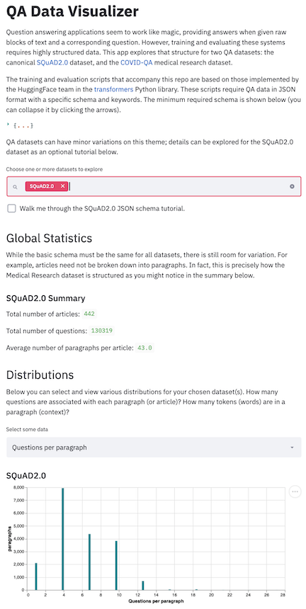

# Deep Learning for Question Answering
This repo accompanies the Cloudera Fast Forward Question Answering [blog series](https://qa.fastforwardlabs.com/) in which each blog post dives deep into various aspects of question answering systems.  For a high level introduction to general QA systems, including the Information-Retrieval based system included here, check out [this post](https://qa.fastforwardlabs.com/methods/background/2020/04/28/Intro-to-QA.html). 

The primary outputs of this repository are three small applications that allow the user to experience a real-world Question Answering system, as well as interact with the data and models that support such a system. Each is briefly described in turn below. 

### WikiQA
This app is a real-world IR-QA system built on top of Wikipedia's search engine.


### Model Explorer
This app allows the user to compare several pre-trained QA Models on various performance measures. 


### Data Visualizer
This app lets the user walk through the structure required to train and evaluate Transformer neural networks for the question answring task.



Instructions are given both for general use (on a laptop, say), and for Cloudera CML and CDSW.
We'll first describe what's here, then go through how to run everything.

## Structure

The folder structure of the repo is as follows

```
.
├── apps      # Three small Streamlit applications.
├── cml       # Contains scripts that facilitate the project launch on CML.
├── data      # Contains pre-computed evaluation data required for the apps. Starter data will also be downloaded here during project launch on CML.
├── scripts   # This is where all the code that does something lives.
└── qa        # A small library of useful functions.
```

There's also an `images` folder that contains images for this README, which can be ignored.
Let's examine each of the important folders in turn.

### `apps`
The applications accompanying this project come with launcher scripts to assist launching an Application with CDSW/CML. To launch the applications in another environment, run the code inside the launcher file, with the prefixed `!` removed. You may need to specify different ports. 

These three apps are largely, but not entirely, independent of the rest of the content contained in this repo, which was developed for practioners to more easily train and evaluate QA models in CML/CDSW. We briefly cover the structure here but save usage details until the end of this README. 

### `qa`
This is a small Python library designed for practioners who want to train and evaluate Transformer models for question answering tasks. This library is not largely used by any of the three apps mentioned above. 

Its structure is as follows:
```
qa
├── data
│   ├── fetch.py     
│   ├── loader.py
│   ├── processing.py
│   └── utils.py
├── arguments.py
├── model_utils.py
└── utils.py
```

### `scripts`
These scripts are to be used in conjunction with the `qa` library above and are thus not used by the apps. 

```
scripts
├── README.md
├── config.txt
├── config_multi-train.py
├── evaluate.py
├── model.py
├── multi-train.py
└── train.py
```

Intended for training and evaluating QA Models, detailed usage for these scripts and the `qa` module are contained in the `README.md` in this directory. 

### `cml`
These scripts serve as launch instructions to facilitate the automated project setup on CML. Each script is triggered by the declarative pipeline as defined in the `.project-metadata.yaml` file found in the project's root directory.

```
cml
├── install_dependencies.py
└── download_data_and_models.py
```
The three applications require two open-source QA datasets, as well as five pre-trained QA models. `download_data_and_models.py` ensures that these datasets and models are immediately available once the automated project setup on CML has completed. 

If you are performing manual setup of this repo, you can either run that script explicitly, or simply start using the apps as intended. The functions are designed such that, if a model is called that has not yet been downloaded, the code will automatically initiate a model download. 

### Installation
The code and applications within were developed against Python 3.6.9, and are likely also to function with more recent versions of Python.

To install dependencies, first create and activate a new virtual environment through your preferred means, then pip install from the requirements file. I recommend:

```python
python3 -m venv .venv
source .venv/bin/activate
pip install -r requirements.txt
```

In CML or CDSW, no virtual env is necessary. Instead, inside a Python 3 session (with at least 2 vCPU / 8 GiB Memory), simply run

```python
!pip3 install -r requirements.txt     # notice `pip3`, not `pip`
```

Next, install the `qa` module from this repository, with

```python
pip3 install -e .
```

from inside the root directory of this repo.

### Data
The apps and scripts designed to work with the `qa` library make use of two open source question answering datasets. 

* [SQuAD2.0](https://rajpurkar.github.io/SQuAD-explorer/) is a canonical QA dataset that is the current benchmark against which all QA models are evaluated. 
* [COVID-QA](https://github.com/deepset-ai/COVID-QA) is a smaller dataset of medical research papers and questions focused on the novel coronavirus. 

### Starting the Applications
As mentioned earlier, each application comes with a launcher scripts to assist launching an Application with CDSW/CML. However, you can also launch the applications from a Session or in another environment altogether. 

For example, to launch WikiQA in a CML/CDSW session use

`!streamlit run apps/wikiqa.py  --server.port $CDSW_APP_PORT --server.address 127.0.0.1`

(This is the same as executing the launch script itself.)

In a local environment (your laptop, say), you can instead simply call

`streamlit run apps/wikiqa.py`

-------------------------
